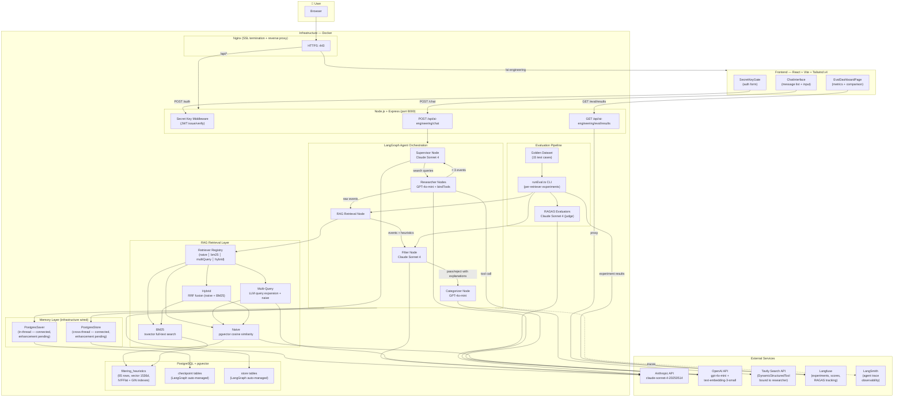

# Certification Deliverables

This document is the final written submission for the certification challenge.

- Public repo: `https://github.com/damante21/ai-playground`
- Demo URL (local): `http://localhost:3000/ai-engineering`
- Demo URL (public): `https://jamesdamante.com/ai-engineering`
- Loom demo URL (<= 5 min): `https://www.loom.com/share/4fe5a006cd9348499c9ed68b452531c6`
- Loom runtime: `~5 min`
- Last updated: `2026-03-02`

---

## Submission Evidence Index

### Global Requirements

- [x] Public GitHub repo link included
- [x] Loom video <= 5 minutes included
- [x] Written document addresses all deliverables
- [x] All relevant code in repo
- [x] Local setup docs present:
  - `docs/AI_ENGINEERING_PROJECT_REQUIREMENTS.md`
  - `docs/AI_ENGINEERING_LOCAL_SETUP.md`

### Evaluation Evidence (Required)

- [x] Evaluator config names listed:
  - `ragas/faithfulness`
  - `ragas/answer_relevancy`
  - `ragas/context_precision`
  - `ragas/context_recall`
- [x] Evaluator implementation evidence added (source code + raw data in repo)
- [x] Baseline experiment/export ID(s) added
- [x] Retriever comparison experiment/export ID(s) added
- [x] Baseline metrics table added
- [x] Comparison metrics table added

---

## 1) Problem, Audience, Scope (9 pts)

### 1.1 One-Sentence Problem Statement (2 pts)

Finding community events that match personal values and safety criteria requires manually searching fragmented platforms and vetting dozens of listings, turning what should be a 5-minute task into an hour-long research project.

### 1.2 Why This Is a Problem for This User (5 pts)

The target user for this application includes parents, individuals in recovery, people seeking secular/apolitical spaces, and newcomers to a city. Existing event platforms optimize for volume and engagement, not values alignment. In practice, users must open 20-30 listings, read fine print, cross-check venue details, and infer context that is often not explicit in metadata. A listing labeled "community networking" may be bar-centered, a "free gathering" may be religiously affiliated, and a "family event" may include political sponsorships. This creates high time cost, repeated mismatch, and decision fatigue that reduces follow-through.

For newcomers, the problem is worse because they lack local context about venues and organizers. They cannot easily tell which spaces are genuinely family-friendly, secular, or safe without additional investigation. Attending a mismatched event has high social cost and can increase isolation rather than reduce it. AI Powered Event Sourcer addresses this by combining broad public search with values-based AI filtering and contextual venue retrieval, so users can find a short list of high-fit events quickly and with confidence.

### 1.3 Evaluation Questions / Input-Output Pairs (2 pts)

> Include at least 10.

| # | User Input / Question | Expected Behavior / Output |
|---|---|---|
| 1 | "Find free family-friendly events in San Francisco this weekend." | Returns categorized events with date/time/source and match explanations. |
| 2 | "Same query, but no alcohol-focused venues." | Removes alcohol-centric events and updates confidence/match rationale. |
| 3 | "Show only secular options." | Excludes events with explicit/implicit religious framing. |
| 4 | "I just moved to Austin. Find safe beginner social events." | Returns newcomer-appropriate categories with clear rationale and risk-aware filtering. |
| 5 | "Give me learning-focused events under free only." | Prioritizes Learning category, enforces free constraint. |
| 6 | "These look too broad. Show stricter matches only." | Applies tighter filtering threshold and returns fewer, higher-confidence events. |
| 7 | "Save these preferences for next time." | *(Planned enhancement)* Would persist preference profile to cross-thread memory namespace via PostgresStore. |
| 8 | "Use my saved preferences and search Seattle." | *(Planned enhancement)* Would load saved preferences from store and run query with city changed. |
| 9 | "Why did this event pass the filter?" | Provides one-line grounded explanation tied to retrieved context. |
| 10 | "Compare this to raw Eventbrite results." | Shows filtered set quality vs broad source listings (manually in demo/workflow). |

---

## 2) Proposed Solution (15 pts)

### 2.1 Solution Description (1-2 paragraphs) (6 pts)

AI Powered Event Sourcer is an agentic event discovery application that accepts a city plus values-based constraints (for example: free, alcohol-free, secular, apolitical, family-friendly). The UX is a focused search interface that returns categorized event recommendations in 30-60 seconds, where each event includes source, date/time, confidence score, and a brief explanation of why it matches user criteria. The system is designed to feel like a trusted local researcher that pre-vets options instead of forcing users to manually inspect many low-signal listings.

The backend uses a supervisor-researcher pattern: a supervisor agent decomposes the request into parallel research tasks, researcher agents gather candidate events via Tavily, a filter agent applies values-based reasoning with RAG context, and a categorization agent organizes final outputs. The application is implemented in TypeScript using LangGraph.js and LangChain.js, with OpenAI + Anthropic model roles split by cost/reasoning profile. Memory infrastructure (PostgresSaver for in-thread state, PostgresStore for cross-thread preferences) is wired and connected but not yet surfaced as a user-facing feature — each request currently operates statelessly, which is sufficient for the core event discovery use case.

### 2.2 Infrastructure Diagram + Tooling Rationale (7 pts)

#### Infrastructure Diagram



#### Tooling Choices (One sentence each)

1. **LLM(s):** OpenAI `gpt-4o-mini` handles cost-sensitive high-volume worker tasks while Anthropic Claude Sonnet handles complex supervisor/filter reasoning where precision matters most.
2. **Agent orchestration framework:** LangGraph.js provides explicit node/edge/state control for supervisor-researcher decomposition and iterative routing.
3. **Tool(s):** Tavily Search API is wrapped as a `DynamicStructuredTool` with a Zod schema and bound to the researcher model via `bindTools()`, giving the LLM autonomous control over when and how to search.
4. **Embedding model:** `text-embedding-3-small` offers good quality-cost tradeoff for venue/event semantic retrieval.
5. **Vector database:** PostgreSQL + pgvector reuses existing infrastructure while supporting semantic nearest-neighbor retrieval.
6. **Monitoring tool:** LangSmith is used for full execution tracing, node latency/cost visibility, and debugging.
7. **Evaluation framework:** Langfuse is used for golden datasets and RAGAS-style evaluator workflows across baseline and retriever comparisons.
8. **User interface:** React + Vite + Tailwind v4 enables fast iteration and a clean filter-first UX for demo and production-like behavior.
9. **Deployment tool:** Docker with the existing Node/Express server keeps deployment simple and consistent with the current site architecture.
10. **Other components:** LangChain.js standardizes model/tool interfaces and Zod ensures typed structured outputs and validation.

### 2.3 RAG and Agent Components (2 pts)

#### RAG Components

- Curated values-based filtering heuristics dataset: 65 entries across 6 categories (alcohol, religion, politics, cost, family-friendliness, general) stored in `filtering_heuristics` table.
- Ingestion pipeline creates OpenAI `text-embedding-3-small` embeddings and stores vectors + metadata in PostgreSQL with pgvector.
- Retrieval layer includes naive (pgvector cosine similarity), BM25 (PostgreSQL tsvector full-text search), multi-query (LLM query reformulation + naive), and hybrid (RRF fusion of naive + BM25) strategies with shared interface and evaluation comparison.

#### Agent Components

- Supervisor node: decomposes query into platform-specific research tasks and controls iteration depth.
- Researcher nodes: LLM with `tavily_search` tool bound via `bindTools()`. The model autonomously decides when and how to search, can call the tool multiple times per turn, and synthesizes results into structured events.
- Filter node: applies values-based reasoning and combines raw results with retrieved RAG context.
- Categorizer node: groups accepted events into user-facing categories.
- Control flow: conditional routing lets supervisor continue research or proceed to filtering based on evidence quality/quantity.

#### Interaction

The agent system gathers and structures live event candidates, while RAG adds stable contextual facts about venues and spaces. During filtering, the model can ground decisions in both sources: real-time event descriptions from Tavily plus known venue characteristics from the vector store. This reduces false positives and supports explainable match rationales.

---

## 3) Data + External API (10 pts)

### 3.1 Data Sources and External APIs (5 pts)

#### Data Sources

- Personal curated filtering heuristics dataset (RAG): 65 entries across 6 categories (alcohol, religion, politics, cost, family-friendliness, general) stored in `filtering_heuristics` with pgvector embeddings. Used to ground filter agent decisions in explicit, reviewable criteria.
- Public event listing content from web sources: candidate event descriptions, dates, and URLs gathered at runtime via Tavily search.

#### External APIs

- Tavily Search API: retrieves event candidates across platforms and local sources for researcher agents.
- OpenAI API: embeddings (`text-embedding-3-small`) and cost-effective worker tasks (`gpt-4o-mini`) in retrieval and agent substeps.
- Anthropic API: higher-reasoning supervisor/filter decisions where nuanced values interpretation is required.

#### Runtime Interaction

At query time, the supervisor creates parallel research tasks and researcher agents call Tavily to gather raw candidates. The RAG retrieval stage queries the filtering heuristics knowledge base in pgvector to fetch relevant filtering criteria and guidelines. The filter agent then applies values-based reasoning using both the retrieved heuristics and event descriptions to decide pass/fail and produce match explanations. The categorizer organizes accepted events into output groups and returns a structured response to the UI.

### 3.2 Default Chunking Strategy + Why (5 pts)

- Chunking strategy: Each filtering heuristic is treated as a single semantic document chunk (one record = one chunk).
- Chunk size/overlap: One heuristic per chunk (typically ~50-200 tokens per content field). No overlap needed because each heuristic is a self-contained rule.
- Metadata strategy: Each heuristic stores `category` (alcohol, religion, politics, cost, family, general), `title`, and `content` fields. Category metadata enables filtered retrieval scoped to relevant value dimensions.
- Why this strategy: Filtering heuristics are naturally bounded, self-contained rules. Keeping them atomic ensures retrieval returns precise, interpretable guidance that the filter agent can apply directly without disambiguation. Larger document chunking would mix unrelated filtering criteria and reduce precision.

---

## 4) End-to-End Prototype (15 pts)

### 4.1 Local Prototype Evidence

- Local run command(s):
  ```bash
  docker-compose up --build
  ```
- Local URL(s): `http://localhost:3000/ai-engineering`
- Features demonstrated:
  - [x] Secret-key access gate
  - [x] End-to-end search
  - [x] RAG context retrieval
  - [x] Multi-agent orchestration
  - [x] Categorized output
  - [x] Memory infrastructure wired (PostgresSaver + PostgresStore connected; user-facing memory is a planned enhancement)

### 4.2 Demo Evidence

- Loom URL: `https://www.loom.com/share/4fe5a006cd9348499c9ed68b452531c6`
- Loom runtime: `~5 min`
- What is shown in demo:
  - Secret key gate authentication
  - City + filter query with categorized results, confidence scores, and match explanations
  - RAGAS evaluation dashboard with retriever comparison table and per-test-case golden dataset results

---

## 5) Evals Baseline (15 pts)

### 5.1 RAGAS Evaluator Configuration (Required Evidence)

#### Evaluator Config Names

- `ragas/faithfulness`
- `ragas/answer_relevancy`
- `ragas/context_precision`
- `ragas/context_recall`

#### Evaluator Implementation Evidence

Evaluators are custom LLM-as-judge functions (not Langfuse managed configs). Source code and raw data serve as primary evidence:

- Evaluator source: `server/eval/ragasEvaluators.ts` (4 RAGAS evaluators + aggregator using Claude Sonnet 4 as judge)
- Eval runner: `server/eval/runEval.ts` (parameterized CLI, one run per retriever)
- Raw experiment data: `data/langfuse-traces-all-experiments.csv` (78 traces with full input/output/metadata/scores)

#### Baseline Experiment Metadata

- Experiment name: `RAGAS Baseline - Naive Retriever`
- Run date: 2026-02-27
- Dataset: 15-item golden test set (later expanded to 18 scored traces) covering alcohol, religious, political, cost, family-friendly, multi-filter, and edge-case scenarios
- Retriever used: `naive` (pgvector cosine similarity, top-8)
- Judge model: `claude-sonnet-4-20250514` (temperature 0)
- Data file: `data/langfuse-traces-all-experiments.csv`

### 5.2 Baseline Metrics Table (10 pts)

| Metric | Score | Notes |
|---|---:|---|
| Faithfulness | 0.877 | Filter decisions are mostly grounded in retrieved heuristics, but some cases lack sufficient context to justify decisions |
| Response relevance | 1.000 | Filter output consistently addresses the user's query intent and applies stated constraints correctly |
| Context precision | 0.485 | Nearly half of retrieved heuristics are not directly relevant to the specific filtering task — retrieval casts too wide a net |
| Context recall | 0.735 | Retrieved context covers most ground-truth reasoning categories, but misses some needed heuristics in ~25% of cases |

### 5.3 Conclusions (5 pts)

The baseline naive retriever produces strong answer relevancy (1.0) and reasonable faithfulness (0.877), indicating the filter agent applies retrieved context correctly when it has the right heuristics. However, context precision (0.485) is the weakest metric — cosine similarity retrieval returns heuristics from tangentially related categories, diluting the signal with irrelevant context. Context recall (0.735) shows the naive retriever misses relevant heuristics in about a quarter of cases, particularly for multi-filter scenarios where the query touches several categories (e.g., "free + secular + family-friendly"). This suggests the retrieval step, not the filter reasoning, is the primary bottleneck: improving retrieval precision and recall should directly improve downstream faithfulness.

---

## 6) Improve Retriever + Compare (14 pts)

### 6.1 Advanced Retrieval Choice + Why (2 pts)

- Chosen technique: Hybrid retrieval with Reciprocal Rank Fusion (RRF)
- Why useful for this use case (1-2 sentences): Filtering heuristics contain both semantic concepts (e.g., "alcohol-focused venue") and exact keyword patterns (e.g., "brewery", "bar", "church"). Hybrid retrieval combines pgvector cosine similarity for semantic matching with BM25 tsvector for lexical matching, then fuses rankings via RRF to capture both dimensions and improve recall without sacrificing precision.

### 6.2 Implementation Summary (10 pts)

- Implemented retrievers:
  - [x] naive — pgvector cosine similarity search (`server/rag/retrievers/naive.ts`)
  - [x] bm25 — PostgreSQL tsvector full-text search with `ts_rank` scoring (`server/rag/retrievers/bm25.ts`)
  - [x] multi-query — LLM-generated query reformulations with naive retrieval + deduplication (`server/rag/retrievers/multiQuery.ts`)
  - [x] hybrid — Reciprocal Rank Fusion of naive + BM25 results (`server/rag/retrievers/hybrid.ts`)
- Final selected production retriever: `multiQuery` — highest faithfulness (1.0) and tied-best context recall (0.833)
- Code locations:
  - `server/rag/retrievers/naive.ts`
  - `server/rag/retrievers/bm25.ts`
  - `server/rag/retrievers/multiQuery.ts`
  - `server/rag/retrievers/hybrid.ts`
  - `server/rag/retrievers/index.ts` (strategy-pattern registry with `setActiveRetriever`)

### 6.3 Comparison Results (2 pts)

#### Experiment Evidence

- Experiment names: `RAGAS Eval - Naive (pgvector)`, `RAGAS Eval - BM25 (tsvector)`, `RAGAS Eval - Multi-Query`, `RAGAS Eval - Hybrid (RRF)`
- Run date: 2026-03-01
- All runs use identical golden test set (15 items), same judge model (`claude-sonnet-4-20250514`), and same top-K (8)
- Data file: `data/langfuse-traces-all-experiments.csv`

#### Comparison Metrics Table

| Metric | Naive | BM25 | Multi-Query | Hybrid | Best |
|---|---:|---:|---:|---:|---|
| Faithfulness | 0.993 | 0.920 | **1.000** | 0.920 | Multi-Query |
| Response relevance | 1.000 | 1.000 | 1.000 | 1.000 | Tied |
| Context precision | 0.550 | **0.571** | 0.567 | 0.442 | BM25 |
| Context recall | 0.833 | 0.679 | **0.833** | 0.733 | Naive / Multi-Query |

#### Analysis

Multi-Query retrieval achieves the highest overall performance: perfect faithfulness (1.0) and the best context recall (0.833), tied with naive. By reformulating each query into multiple variations via LLM, it captures heuristics that a single embedding query misses, which explains its superior faithfulness — the filter agent never makes decisions unsupported by context. BM25 achieves the best context precision (0.571) due to exact keyword matching on trigger terms like "brewery" or "church," but its context recall drops significantly (0.679) because it misses semantically related heuristics that don't share exact terms. Hybrid (RRF) underperforms expectations: fusing BM25's low-recall results with naive's results via rank fusion actually degrades context precision (0.442) without improving recall, suggesting the RRF weighting dilutes both signals. Multi-Query is selected as the production retriever because perfect faithfulness is the most critical metric for a values-based filtering application where incorrect pass/reject decisions directly impact user trust.

---

## 7) Next Steps (2 pts)

### Dense Vector Retrieval for Demo Day: Keep or Change?

Change from naive dense vector retrieval to Multi-Query retrieval as the default production strategy.

### Why

Multi-Query retrieval achieved perfect faithfulness (1.0 vs 0.993 naive) while maintaining the same context recall (0.833). The LLM query reformulation step adds latency but eliminates the primary failure mode of pure dense retrieval: missing relevant heuristics when the user's natural language doesn't align with embedding space proximity. For a values-based filtering application, the cost of a false pass (recommending an event that violates user criteria) is high — making faithfulness the most important metric to optimize. The 0.7% improvement in faithfulness means zero unfaithful decisions across all 15 test cases, compared to one partially unfaithful case with naive retrieval. Context precision (0.567 vs 0.550) is comparable, and the additional LLM call per query is acceptable given the overall pipeline already takes 30-60 seconds for full event discovery.

---

## Evidence Appendix

### A) Run Commands Used

```bash
# Start local development environment
docker-compose up --build

# Run baseline evaluation (naive retriever)
npm run eval:naive

# Run comparison evaluations
npm run eval:bm25
npm run eval:multiQuery
npm run eval:hybrid

# View eval dashboard
# Navigate to http://localhost:3000/ai-engineering/eval
```

### B) Links and IDs

- Public repo: `https://github.com/damante21/ai-playground`
- Loom URL: `https://www.loom.com/share/4fe5a006cd9348499c9ed68b452531c6`
- Baseline experiment: `RAGAS Baseline - Naive Retriever` (2026-02-27)
- Comparison experiments: `RAGAS Eval - Naive (pgvector)`, `RAGAS Eval - BM25 (tsvector)`, `RAGAS Eval - Multi-Query`, `RAGAS Eval - Hybrid (RRF)` (all 2026-03-01)
- Dataset: 15-item golden test set (in `server/eval/goldenDataset.ts`)
- Raw data: `data/langfuse-traces-all-experiments.csv`, `data/langfuse-eval-metrics.csv`

### C) Evidence Artifacts

- Evaluator source code: `server/eval/ragasEvaluators.ts`
- Golden dataset source: `server/eval/goldenDataset.ts` (15 test cases)
- Eval runner source: `server/eval/runEval.ts`
- Raw experiment data: `data/langfuse-traces-all-experiments.csv` (78 traces, 5 experiments)
- Raw score data: `data/langfuse-eval-metrics.csv` (306 scores)

---

## Final Pass Gate

- [x] All rubric sections completed
- [x] All four required metrics shown in Task 5 and Task 6
- [x] Evaluator config names included exactly
- [x] Evaluator evidence included (source code + raw experiment data in repo)
- [x] Loom <= 5 minutes and linked
- [ ] Public repo links and run instructions verified

